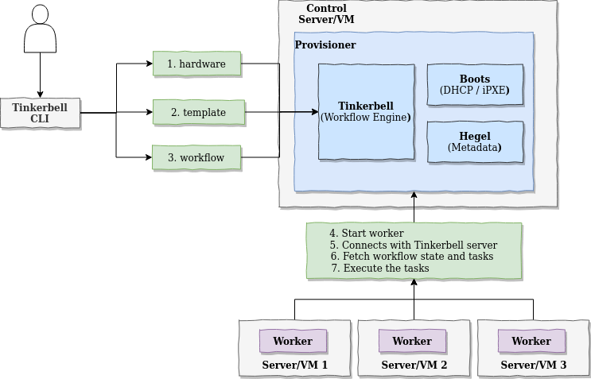

# Tinkerbell

Outline:
 * [Boot Flow](#the-boot-flow)
 * [Tinkerbell Architecture](#tinkerbell-inside)
 * [The Install](#the-install)
    *[Home ROuter Setup](#home-router-config-for-dhcp-reservations)
   * [Virtual Box](#virtual-box-control-server-for-provisioning-stack)
   * [Try Helm](#bringing-up-a-provisioner-stack-with-kubernetes)
   * [Try Docker Compose](#bringing-up-a-provisioner-stack-with-docker-compose--got-stuck-but-here-it-is-)

References:
 * Main Website [tinkerbell.org](https://tinkerbell.org)

## The Boot Flow
[TInkerbell 101](https://www.youtube.com/watch?v=Y04eCSKaQCc)

Acronyms
 * DHCP -  Dynamic Host Configuration Protocol - Give network configs systems that ask
 * TFTP - Trivial File Transfer Protocol - File transfer
 * PXE - Preboot Execution Environment - Server initiated OS load

The Boot Flow
1. Power on New server. 
2. Complete POST Power On Self Test
4. Bios can also be set to boot to network, instead of local drive
5. It will then broadcast the MAC Address to the network. 
6. DHCP server will then give an IP and the New Server will accept it and will reserve it. 
7. DHCP can also send. IP of the boot server. and the filename of the prelinux.0 preboot OS
8. New Server then request TFTP of preboot OS  from the Boot Server. 
9. PXE will load and run that preboot OS.  
10. PXE code will now send a message with the MAC address and say it is from the given IP and will send the PXE Label
11. Deployment server will see the mac address and thens end the right OS based on the PXE label. 
12. kernel will then get vmlinuz and initradisk with TFTP

Custom Scripting and Old Legacy Software.  THese tech are from the 90s.

## Tinkerbell Inside

Tinkerbell is new. 2020s baremetal stack. 

[Architecture ref](https://docs.tinkerbell.org/architecture/)

Components: 
 * Boots - DHCP & IPXE Server - reimplemented TFTP and PXE in Go. 
 * OSIE - In-Memory Boostraper Alpine Linux and Docker engine.
 * Tinkerbell - Provisioning and Workflow engine.  
   * What - Declarative Yaml Template
   * Who A machine or worker
   * This is going to send stuff as containers to OSIE.  
 * Hegel - Metadata Service
   * What ever workflow you right, it can interogate the Hegel metadata.  
   * So every server gets Ubuntu.  But when it does its cloud init
   * Hegel will give the unique metadata for that mac address. 
   * Metadata server is very cloudlike..  Same OS, unique stuff in configuration

[Tinkerbell, a deep dive into the magic of cloud native bare metal]   (https://www.youtube.com/watch?v=YMA70xZlKic&t=4s)

Cloud Native Bare Metal!

Crocodile - Operating system images are created in Crocodile which uses Packer (Hashicorp Packer I believe)
Hook (New version replacing OSIE) - Recently Replaced LinuxKit from Docker. 
ORAS - OCI Registry as Storage 
DOcker - executing Workflows. 
Packer - Part of OS Build

The Boot Flow
1. Through Tink-CLI the admin adds a mapping between a mac address and a tinkerbell worflow
2. This goes into Tink-server (Tinkerbell)
3. Boots - the DHCP server, and TFTP on waiting for new servers 
4. Power on New server. 
2. Complete POST Power On Self Test
4. Bios can also be set to boot to network, instead of local drive
5. It will then broadcast the MAC Address to the network. 
6. Boots will respond and give it the IP
7. Boots will also give it the PXE preboot in memory os with TFTP
8. PXE on the New Server will load and run that preboot OS.  
10. PXE code will now send a message with the MAC address and say it is from the given IP and will send the PXE Label
11. Tink-server will give it the tinkerbell workflow associated with that mac address.  
12. ie say the workflow is to load UBUNTU. THis will get loaded in with containers this will then stream Ubuntu on the hard drive
13. And then its ready to go. 

Common Actions
 * Image2disk
 * oci2disk
 * archive2disk

Typically stream an OS that gets written to a block device. 

PostInstall Actions. 
 * Modify the newly deployed OSm disks, files or install boot loaders. 
 * Kexec/reboot - either reboot the machine or kexec to immediately drop into the new OS.

## The Install 

First thing that kinda drives me nuts, is that there isn't anywhere in Tinkerbell that
says that you can install things on a mac.. but on [EKS Anywhere on Bare Metal docs](https://anywhere.eks.amazonaws.com/docs/reference/baremetal/bare-prereq/)
you have things like this:

> All EKS Anywhere machines, including the Admin, control plane and worker machines, must be on the same 
> layer 2 network and have network connectivity to the BMC (IPMI, Redfish, and so on).

And [Install EKS Anywhere](https://anywhere.eks.amazonaws.com/docs/getting-started/install/)

>If you are using Docker Desktop, you need to know that:
> * For EKS Anywhere Bare Metal, Docker Desktop is not supported
> * For EKS Anywhere vSphere, if you are using Mac OS Docker Desktop 4.4.2 or newer 
> "deprecatedCgroupv1": true must be set in 
> ~/Library/Group\ Containers/group.com.docker/settings.json.
 
In the Tinkerbell docs I didn't see any mention of this, but I did see them discussing it 
in a video.  One said, that you can set up a Virtual Box Ubuntu and then a Bridge to the Network
of the Laptop.  So that is what I am doing.  

### Virtual Box Control Server for Provisioning Stack

Covering that in another [doc on virtualbox](virtualbox.md)

In the end I have a a new ubuntu 22.04 machine Git, Docker, and Docker Compose

      ubuntu@Tinkerbell:~/src$ ip address
      ...
      2: enp0s3: <BROADCAST,MULTICAST,UP,LOWER_UP> mtu 1500 qdisc fq_codel state UP group default qlen 1000
          link/ether 08:00:27:1d:c9:7e brd ff:ff:ff:ff:ff:ff
          inet 192.168.0.45/24 brd 192.168.0.255 scope global dynamic noprefixroute enp0s3
             va
      ubuntu@Tinkerbell:~/src$ git version
      git version 2.34.1
      ubuntu@Tinkerbell:~/src$ docker compose version 
      Docker Compose version v2.14.1
      ubuntu@Tinkerbell:~/src$ docker version
      Client: Docker Engine - Community
       Version:           20.10.22
       API version:       1.41

`ubuntu` is the admin account with no password sudo, and youc an no password ssh from the mac. 

### Home Router Config for DHCP Reservations

The other thing we need to do is get my dhcp server to not perform DHCP services 
for my cluster.  I didn't take my home router DHCP out of the address range, but rather 
manually assigned the mac addresses to the same IPs I am going to set them up with 
from Tinkerbell.  

//TODO: Did Tinkerbell and the kids work ok with Home Router set up this way?

Covering that here [doc on my router](router.md)

So from the Router we mapped the mac addresses to IP reservations and the IP reservations 
to local DNS names. 

    i5nuc1 is 192.168.0.50
    i5nuc2 is 192.168.0.51
    i5nuc3 is 192.168.0.52
    i3nuc1 is 192.168.0.53
    i3nuc2 is 192.168.0.54
    i3nuc3 is 192.168.0.55

### Bringing up a Provisioner Stack with Kubernetes

https://github.com/tinkerbell/charts/tree/main/tinkerbell/stack

I did the docker compose before trying kubernetes so check what I set up [there](#bringing-up-a-provisioner-stack-with-docker-compose--got-stuck-but-here-it-is-)

Install Minikube 

 * https://minikube.sigs.k8s.io/docs/start/
      
      curl -LO https://storage.googleapis.com/minikube/releases/latest/minikube_latest_amd64.deb
      sudo dpkg -i minikube_latest_amd64.deb

then as root I did: 

      root@Tinkerbell:~/src/sandbox/deploy/stack/compose# minikube start
      😄  minikube v1.28.0 on Ubuntu 22.04 (vbox/amd64)
      ✨  Automatically selected the docker driver. Other choices: ssh, none
      🛑  The "docker" driver should not be used with root privileges. If you wish to continue as root, use --force.
      💡  If you are running minikube within a VM, consider using --driver=none:
      📘    https://minikube.sigs.k8s.io/docs/reference/drivers/none/
      
      ❌  Exiting due to DRV_AS_ROOT: The "docker" driver should not be used with root privileges.

switching to ubuntu:
      
      ubuntu@Tinkerbell:~$ minikube start
      😄  minikube v1.28.0 on Ubuntu 22.04 (vbox/amd64)
      👎  Unable to pick a default driver. Here is what was considered, in preference order:
          ▪ docker: Not healthy: "docker version --format {{.Server.Os}}-{{.Server.Version}}" exit status 1: Got permission denied while trying to connect to the Docker daemon socket at unix:///var/run/docker.sock: Get "http://%2Fvar%2Frun%2Fdocker.sock/v1.24/version": dial unix /var/run/docker.sock: connect: permission denied
          ▪ docker: Suggestion: Add your user to the 'docker' group: 'sudo usermod -aG docker $USER && newgrp docker' <https://docs.docker.com/engine/install/linux-postinstall/>
      💡  Alternatively you could install one of these drivers:
          ▪ kvm2: Not installed: exec: "virsh": executable file not found in $PATH
          ▪ podman: Not installed: exec: "podman": executable file not found in $PATH
          ▪ vmware: Not installed: exec: "docker-machine-driver-vmware": executable file not found in $PATH
          ▪ virtualbox: Not installed: unable to find VBoxManage in $PATH
          ▪ qemu2: Not installed: exec: "qemu-system-x86_64": executable file not found in $PATH
      
      ❌  Exiting due to DRV_NOT_HEALTHY: Found driver(s) but none were healthy. See above for suggestions how to fix installed drivers.
      
Doing what they suggested.. 

      ubuntu@Tinkerbell:~$ sudo usermod -aG docker $USER && newgrp docker
      ubuntu@Tinkerbell:~$ minikube start

And we are gold

      ubuntu@Tinkerbell:~$ kubectl get pods
      No resources found in default namespace.

Install helm

https://helm.sh/docs/intro/install/

      curl https://baltocdn.com/helm/signing.asc | gpg --dearmor | sudo tee /usr/share/keyrings/helm.gpg > /dev/null
      sudo apt-get install apt-transport-https --yes
      echo "deb [arch=$(dpkg --print-architecture) signed-by=/usr/share/keyrings/helm.gpg] https://baltocdn.com/helm/stable/debian/ all main" | sudo tee /etc/apt/sources.list.d/helm-stable-debian.list
      sudo apt-get update
      sudo apt-get install helm

THis all worked and I ended up with

      ubuntu@Tinkerbell:~/src$ helm version
      version.BuildInfo{Version:"v3.10.3", GitCommit:"835b7334cfe2e5e27870ab3ed4135f136eecc704", GitTreeState:"clean", GoVersion:"go1.18.9"}

get the chart repo

edit the values.yaml per the document https://github.com/tinkerbell/charts/tree/main/tinkerbell/stack

cd to `~/src/charts/tinkerbell`

      ubuntu@Tinkerbell:~/src/charts/tinkerbell/stack$ vi values.yaml 
      ubuntu@Tinkerbell:~/src/charts/tinkerbell/stack$ cd .. 
      ubuntu@Tinkerbell:~/src/charts/tinkerbell$ helm dependency build stack/
      Saving 4 charts
      Deleting outdated charts
      ubuntu@Tinkerbell:~/src/charts/tinkerbell$ trusted_proxies=$(kubectl get nodes -o jsonpath='{.items[*].spec.podCIDR}' | tr ' ' ',')
      ubuntu@Tinkerbell:~/src/charts/tinkerbell$ helm install stack-release stack/ --create-namespace --namespace tink-system --wait --set "boots.trustedProxies=${trusted_proxies}" --set "hegel.trustedProxies=${trusted_proxies}"

### Bringing up a Provisioner Stack with Docker Compose (Got stuck but here it is)

[Tinkerbell Sandbox doc for Docker Compose](https://github.com/tinkerbell/sandbox/blob/main/docs/quickstarts/COMPOSE.md)

Git the sandbox

      ubuntu@Tinkerbell:~$ mkdir src
      ubuntu@Tinkerbell:~$ cd src
      ubuntu@Tinkerbell:~/src$ git clone https://github.com/tinkerbell/sandbox.git
      Cloning into 'sandbox'...
      remote: Enumerating objects: 1680, done.
      remote: Counting objects: 100% (808/808), done.
      remote: Compressing objects: 100% (366/366), done.
      remote: Total 1680 (delta 498), reused 571 (delta 437), pack-reused 872
      Receiving objects: 100% (1680/1680), 1.00 MiB | 2.47 MiB/s, done.
      Resolving deltas: 100% (846/846), done.
      ubuntu@Tinkerbell:~/src$ cd sandbox
      ubuntu@Tinkerbell:~/src/sandbox$

So the next step is.. confounding:

>     # This should be an IP that's on an interface where you will be provisioning machines
>     export TINKERBELL_HOST_IP=192.168.2.111
   
Is the ip of the virtualbox machine or another IP?  I think it is.  :(

      export TINKERBELL_HOST_IP=192.168.0.45

The next thing is interesting... It's going to autogenerate my Tink hardware, template, 
and workflow records for a machine it's going to provision.  So I think, this an 
actual install.  

    export TINKERBELL_CLIENT_IP=192.168.0.50
    export TINKERBELL_CLIENT_MAC=b8:ae:ed:78:6c:60

Then: 

    ubuntu@Tinkerbell:~/src/sandbox$ cd deploy/stack/compose
    ubuntu@Tinkerbell:~/src/sandbox/deploy/stack/compose$ sudo docker compose up -d

After I get the command line back I have this in my images (hello-world was from docker install)

      ubuntu@Tinkerbell:~/src/sandbox$ sudo docker images
      REPOSITORY                           TAG            IMAGE ID       CREATED         SIZE
      nginx                                alpine         1e415454686a   4 days ago      40.7MB
      bash                                 4.4            afc7a610a9d0   5 weeks ago     11.4MB
      quay.io/tinkerbell/hegel             v0.8.0         ef520ce16dee   7 weeks ago     63MB
      bitnami/kubectl                      1.24.6         e8299656b106   2 months ago    221MB
      quay.io/tinkerbell/tink-controller   v0.8.0         36cd3cf9555b   2 months ago    55.4MB
      quay.io/tinkerbell/tink              v0.8.0         4e612f7ba7ed   2 months ago    58.5MB
      rancher/k3s                          v1.24.4-k3s1   a32cc5db09d0   3 months ago    214MB
      quay.io/tinkerbell/rufio             v0.1.0         833ea939514c   4 months ago    57.8MB
      quay.io/tinkerbell/boots             v0.7.0         54d356eccee5   5 months ago    63.8MB
      hello-world                          latest         feb5d9fea6a5   15 months ago   13.3kB

And these containers running: 

      ubuntu@Tinkerbell:~/src/sandbox$ sudo docker ps --format "{{.Names}}: {{.Image}}"
      compose-tink-controller-1: quay.io/tinkerbell/tink-controller:v0.8.0
      compose-boots-1: quay.io/tinkerbell/boots:v0.7.0
      compose-tink-server-1: quay.io/tinkerbell/tink:v0.8.0
      compose-hegel-1: quay.io/tinkerbell/hegel:v0.8.0
      compose-rufio-1: quay.io/tinkerbell/rufio:v0.1.0
      compose-web-assets-server-1: nginx:alpine
      compose-k3s-1: rancher/k3s:v1.24.4-k3s1

The next step has me checking the sandbox workflow.  

      ubuntu@Tinkerbell:~/src/sandbox$ KUBECONFIG=./state/kube/kubeconfig.yaml kubectl get workflow sandbox-workflow --watch
      Command 'kubectl' not found, but can be installed with:
      snap install kubectl
      Please ask your administrator.

Looking a bit at `snap`  I found this [Official Kubectl install instructions](https://kubernetes.io/docs/tasks/tools/install-kubectl-linux/)
in the section "Install using other package management"

>      snap install kubectl --classic
>      kubectl version --client

Looking up `--classic` I got this link on [classic confinement](https://ubuntu.com/blog/how-to-snap-introducing-classic-confinement)

So:

      ubuntu@Tinkerbell:~/src/sandbox$ sudo snap install kubectl --classic
      kubectl 1.26.0 from Canonical✓ installed
      ubuntu@Tinkerbell:~/src/sandbox$ KUBECONFIG=./state/kube/kubeconfig.yaml kubectl get workflow sandbox-workflow --watch
      W1218 08:31:15.849502 1444840 loader.go:222] Config not found: ./state/kube/kubeconfig.yaml
      E1218 08:31:15.882064 1444840 memcache.go:238] couldn't get current server API group list: <nil>
      E1218 08:31:15.889464 1444840 memcache.go:238] couldn't get current server API group list: <nil>
      E1218 08:31:15.895075 1444840 memcache.go:238] couldn't get current server API group list: <nil>
      E1218 08:31:15.901406 1444840 memcache.go:238] couldn't get current server API group list: <nil>
      error: the server doesn't have a resource type "workflow"

I guess this explains why when I turned on my machine to be provisioned, it didn't work. 

Also why I document every step when doing (dev)ops stuff.  The failures and the side research are 
a good deal of the time and learning that is needed to do it right the next time.  

Added Snap install kubectl to the [ubuntu page](ubuntu.md)

So next I 

      ubuntu@Tinkerbell:~/src/sandbox/deploy/stack/compose$ sudo docker compose down
      ubuntu@Tinkerbell:~/src/sandbox/deploy/stack/compose$ sudo docker compose up

and I start seeing stuff like this.. 

      compose-boots-1                         | panic: listen and serve http: listen tcp 192.168.56.4:80: bind: cannot assign requested address
      compose-boots-1                         | 
      compose-boots-1                         | goroutine 171 [running]:
      compose-boots-1                         | github.com/packethost/pkg/log.Logger.Fatal({{0x1837131?, 0xc000100dc0?}, 0xc000366758?, 0xc000201bd0?}, {0x1a7c9c0?, 0xc000767d10}, {0x0, 0x0, 0x0})
      compose-boots-1                         | 	/home/runner/go/pkg/mod/github.com/packethost/pkg@v0.0.0-20210325161133-868299771ae0/log/log.go:121 +0xa6
      compose-boots-1                         | main.(*BootsHTTPServer).ServeHTTP(0xc000823280, {0xc0006dbab0?, 0xc0008243f0?, 0xc000824420?, 0xc000824450?}, {0xc00004200a, 0xf}, {0x1815f62, 0x6}, 0xc0006dd1a0)
      compose-boots-1                         | 	/home/runner/work/boots/boots/cmd/boots/http.go:136 +0xa05
      compose-boots-1                         | created by main.main
      compose-boots-1                         | 	/home/runner/work/boots/boots/cmd/boots/main.go:224 +0x1c0e
      compose-boots-1 exited with code 2

The addresses were already bound. 

So I `ctrl c`'d out of it and then shut down and restarted the virtualbox. 

And same thing...  so I guess I am just seeing all these logs because I install `kubectl` and actually
my setup is wrong... great. 

So why is it trying to put these in the 192.168.56 subnet.. must be internal to docker. 

Looking for first mention of this ip:

      ubuntu@Tinkerbell:~/src/sandbox/deploy/stack/compose$ nohup sudo docker compose up >& out.out &

So I `tail -f` that file till it starts messing up.  
then:

      ubuntu@Tinkerbell:~/src/sandbox/deploy/stack/compose$ grep 192.168.56 out.out
      compose-boots-1                         | {"level":"info","ts":1671384407.5298123,"caller":"boots/main.go:196","msg":"serving iPXE binaries from local HTTP server","service":"github.com/tinkerbell/boots","pkg":"main","addr":"192.168.56.4/ipxe/"}
      compose-boots-1                         | {"level":"info","ts":1671384407.530229,"caller":"boots/main.go:223","msg":"serving http","service":"github.com/tinkerbell/boots","pkg":"main","addr":"192.168.56.4:80"}
      compose-boots-1                         | {"level":"error","ts":1671384407.5310154,"caller":"boots/http.go:136","msg":"listen and serve http: listen tcp 192.168.56.4:80: bind: cannot assign requested address","service":"github.com/tinkerbell/boots","pkg":"main","error":"listen and serve http: listen tcp 192.168.56.4:80: bind: cannot assign requested address","errorVerbose":"listen tcp 192.168.56.4:80: bind: cannot assign requested address\nlisten and serve http\nmain.(*BootsHTTPServer).ServeHTTP\n\t/home/runner/work/boots/boots/cmd/boots/http.go:135\nruntime.goexit\n\t/nix/store/zcnak5ycnrgwnwhzlm5kfylw8dls7xpj-go-1.18.1/share/go/src/runtime/asm_amd64.s:1571"}
      compose-boots-1                         | panic: listen and serve http: listen tcp 192.168.56.4:80: bind: cannot assign requested address

So its looking for assets from that ip.  

      ubuntu@Tinkerbell:~/src$ grep -r 192.168.56 sandbox/deploy/stack/compose/
      sandbox/deploy/stack/compose/postgres/.env:TINKERBELL_CLIENT_IP=192.168.56.43
      sandbox/deploy/stack/compose/postgres/.env:TINKERBELL_HOST_IP=192.168.56.4
      sandbox/deploy/stack/compose/postgres/generate-tls-certs/csr.json:    "192.168.56.4",
      sandbox/deploy/stack/compose/postgres/create-tink-records/manifests/template/ubuntu-equinix-metal.yaml:          IMG_URL: "http://192.168.56.4:8080/focal-server-cloudimg-amd64.raw.gz"
      sandbox/deploy/stack/compose/postgres/create-tink-records/manifests/template/ubuntu.yaml:          IMG_URL: "http://192.168.56.4:8080/focal-server-cloudimg-amd64.raw.gz"
      sandbox/deploy/stack/compose/postgres/create-tink-records/manifests/hardware/hardware.json:            "address": "192.168.56.43",
      sandbox/deploy/stack/compose/postgres/create-tink-records/manifests/hardware/hardware-equinix-metal.json:            "address": "192.168.56.43",
      sandbox/deploy/stack/compose/postgres/create-tink-records/manifests/hardware/hardware-equinix-metal.json:            "gateway": "192.168.56.4",
      sandbox/deploy/stack/compose/.env:TINKERBELL_CLIENT_IP=192.168.56.43
      sandbox/deploy/stack/compose/.env:TINKERBELL_HOST_IP=192.168.56.4
      sandbox/deploy/stack/compose/manifests/manifests.yaml:          address: 192.168.56.43
      sandbox/deploy/stack/compose/manifests/manifests.yaml:              IMG_URL: "http://192.168.56.4:8080/focal-server-cloudimg-amd64.raw.gz"

So despite having set the environment variable.. 

      ubuntu@Tinkerbell:~/src/sandbox/deploy/stack/compose$ echo $TINKERBELL_CLIENT_IP
      192.168.0.50

It didn't get used.  Possibly because of sudo. Ah.. thats it. 

      ntu@Tinkerbell:~/src/sandbox/deploy/stack/compose$ su -
      Password: 
      root@Tinkerbell:~# pwd
      /root
      root@Tinkerbell:~# cd /home/ubuntu/src/sandbox/deploy/stack/compose/
      root@Tinkerbell:/home/ubuntu/src/sandbox/deploy/stack/compose# docker ps
      CONTAINER ID   IMAGE     COMMAND   CREATED   STATUS    PORTS     NAMES
      root@Tinkerbell:/home/ubuntu/src/sandbox/deploy/stack/compose# export TINKERBELL_HOST_IP=192.168.0.45
      root@Tinkerbell:/home/ubuntu/src/sandbox/deploy/stack/compose# export TINKERBELL_CLIENT_IP=192.168.0.50
      root@Tinkerbell:/home/ubuntu/src/sandbox/deploy/stack/compose# export TINKERBELL_CLIENT_MAC=b8:ae:ed:78:6c:60

docker compose up.. after its quiet.. turn machine on, go to Boot menu and pick LAN.  Better!

Now I get this. 

      compose-boots-1                         | {"level":"info","ts":1671386506.9364069,"caller":"dhcp4-go@v0.0.0-20190402165401-39c137f31ad3/handler.go:105","msg":"","service":"github.com/tinkerbell/boots","pkg":"dhcp","pkg":"dhcp","event":"recv","mac":"b8:ae:ed:78:6c:60","via":"0.0.0.0","iface":"enp0s3","xid":"\"ed:78:6c:60\"","type":"DHCPDISCOVER","secs":28}
      compose-boots-1                         | {"level":"info","ts":1671386506.9365258,"caller":"boots/dhcp.go:88","msg":"parsed option82/circuitid","service":"github.com/tinkerbell/boots","pkg":"main","mac":"b8:ae:ed:78:6c:60","circuitID":""}
      compose-boots-1                         | {"level":"error","ts":1671386506.9366238,"caller":"boots/dhcp.go:101","msg":"retrieved job is empty","service":"github.com/tinkerbell/boots","pkg":"main","type":"DHCPDISCOVER","mac":"b8:ae:ed:78:6c:60","error":"discover from dhcp message: no hardware found","errorVerbose":"no hardware found\ngithub.com/tinkerbell/boots/client/kubernetes.(*Finder).ByMAC\n\t/home/runner/work/boots/boots/client/kubernetes/hardware_finder.go:100\ngithub.com/tinkerbell/boots/job.(*Creator).CreateFromDHCP\n\t/home/runner/work/boots/boots/job/job.go:105\nmain.dhcpHandler.serve\n\t/home/runner/work/boots/boots/cmd/boots/dhcp.go:99\nmain.dhcpHandler.ServeDHCP.func1\n\t/home/runner/work/boots/boots/cmd/boots/dhcp.go:60\ngithub.com/gammazero/workerpool.startWorker\n\t/home/runner/go/pkg/mod/github.com/gammazero/workerpool@v0.0.0-20200311205957-7b00833861c6/workerpool.go:218\nruntime.goexit\n\t/nix/store/zcnak5ycnrgwnwhzlm5kfylw8dls7xpj-go-1.18.1/share/go/src/runtime/asm_amd64.s:1571\ndiscover from dhcp message"}
      compose-k3s-1                           | W1218 18:03:03.154145      14 info.go:53] Couldn't collect info from any of the files in "/etc/machine-id,/var/lib/dbus/machine-id"

The key of which seems to be `,"mac":"b8:ae:ed:78:6c:60","error":"discover from dhcp message: no hardware found"`

But what is this hardware, it can find the client, or it can't find the hardware in Tinkerbell's `hardware.yml`?

Further in the message.  `"errorVerbose":"no hardware found\ngithub.com/tinkerbell/boots/client/kubernetes.(*Finder).ByMAC`

So I went to https://github.com/tinkerbell/boots/blob/main/client/kubernetes  and `hardware_finder.go` seemed promising. 

Found the [byMAC function] (https://github.com/tinkerbell/boots/blob/main/client/kubernetes/hardware_finder.go#:~:text=func%20(f%20*Finder)%20ByMAC(ctx%20context.Context%2C%20mac%20net.HardwareAddr%2C%20_%20net.IP%2C%20_%20string)%20(client.Discoverer%2C%20error)%20%7B)

So what is this `hardwareList := &v1alpha1.HardwareList{}`?  Well this file imports 
`github.com/tinkerbell/tink/pkg/apis/core/v1alpha1`  which looking around, I get a 
[definition of HardwareList](https://github.com/tinkerbell/tink/blob/main/pkg/apis/core/v1alpha1/hardware_types.go#:~:text=type%20HardwareList%20struct,%7D)

This means the hardware list. is wrong, not the client hardware.. it did not find an entry in the list.  

So the weird thing is, in `sandbox/deploy/stack/compose/.env`

>      TINKERBELL_HARDWARE_MANIFEST=/manifests/hardware/hardware.json
>      TINKERBELL_TEMPLATE_MANIFEST=/manifests/template/ubuntu.yaml

But neither of those are directories exist.  Given the / in the front, those must be relative to something other than this 
directory.   

Added values to `.env` instead of `export`s.

root@Tinkerbell:~/src/sandbox/deploy/stack/compose# docker compose up -d

      [+] Running 14/14
       ⠿ Network compose_default                           Created                                                                                                                0.1s
       ⠿ Container compose-manifest-update-1               Started                                                                                                               11.6s
       ⠿ Container compose-fetch-osie-1                    Exited                                                                                                                11.6s
       ⠿ Container compose-k3s-1                           Healthy                                                                                                              147.3s
       ⠿ Container compose-fetch-and-convert-ubuntu-img-1  Exited                                                                                                                13.6s
       ⠿ Container compose-web-assets-server-1             Started                                                                                                               14.9s
       ⠿ Container compose-tink-crds-apply-1               Exited                                                                                                               159.7s
       ⠿ Container compose-rufio-crds-apply-1              Exited                                                                                                               159.6s
       ⠿ Container compose-rufio-1                         Started                                                                                                              161.7s
       ⠿ Container compose-manifest-apply-1                Started                                                                                                              162.3s
       ⠿ Container compose-boots-1                         Started                                                                                                              160.6s
       ⠿ Container compose-tink-controller-1               Started                                                                                                              162.0s
       ⠿ Container compose-hegel-1                         Started                                                                                                              162.4s
       ⠿ Container compose-tink-server-1                   Started                                                                                                              162.1s

//#TODO 14 not 15 like in docs.

And the missing export for the documentation is that you also have to set the 

      export TINKERBELL_CLIENT_GW=192.168.0.1

### 
