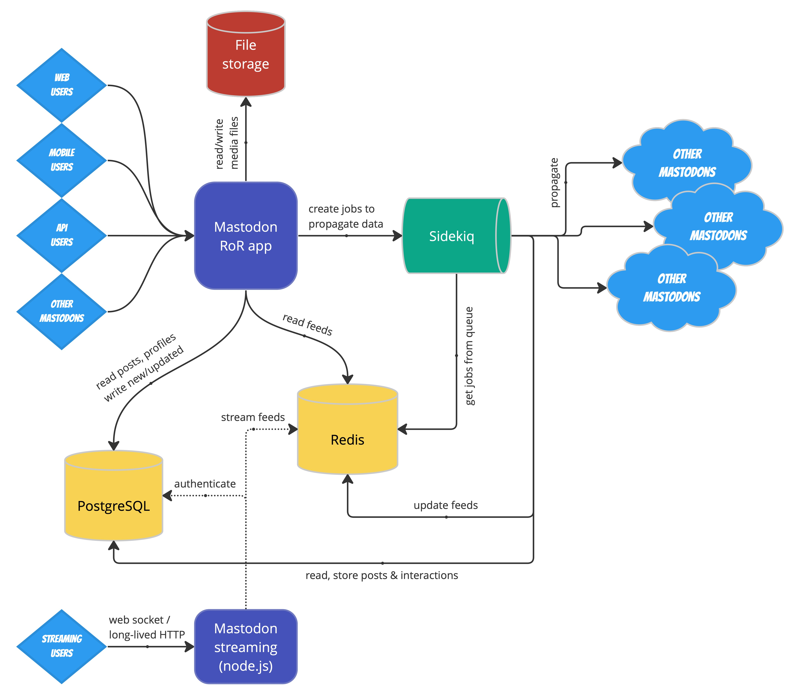
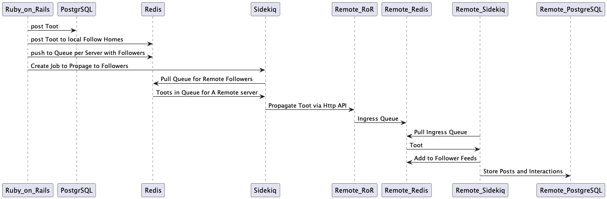
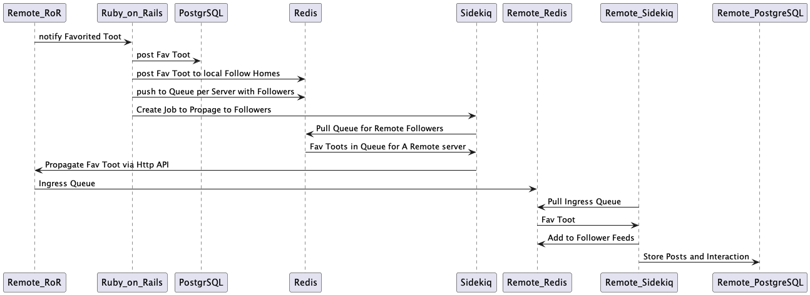

# Mastodon Stack

## References
 * Debian, nginx, react.js, node.js (for Streaming API) ,  Ruby on rails, Postgres. https://github.com/mastodon/mastodon
 * The Architecture of Mastodon. https://softwaremill.com/the-architecture-of-mastodon/ 
 * Hachyderm.io. Kris Nova’s setup https://medium.com/@kris-nova/hachyderm-infrastructure-74f518bc7472
 * Scaling a Mastadon Instance. https://leah.is/posts/scaling-the-mastodon/
 * Scaling Mastadon.  https://hazelweakly.me/blog/scaling-mastodon/

## Architecture 

Notes on https://softwaremill.com/the-architecture-of-mastodon/

### Storage

PostgreSQL database is the minimum thing to backup.  This has users and posts.  Deeper in the
article they cover scaling PostgreSQL with Read replicas, the app is heaving on read.  Would 
be nice to start with a Write DB and at least a read replica. 

//TODO Check out [Mastodon Postgres TODOs here](postgresql.md)

Second Store is Redis with 2 roles
 * Job System Store
 * And data storage for Mastodon Job

Job system does the "most interesting work" and is powered by Sidekiq, this seems to have a 
lot of comercial offerings and such so [local page to capture things about sidekiq](sidekiq.md)

And somewhere in this mix.. you can "instead" use [Elastic search for posts that you have authored](https://docs.joinmastodon.org/admin/optional/elasticsearch/)
favorited, or been mentioned in.  //TODO.. What does this if not Elastic Search? 

And Streaming requests [through a node.js](https://docs.joinmastodon.org/methods/streaming/)
//TODO this authenticates with Postgresql but streams feeds.  

//TODO get a better idea of Feeds vs Posts.  

Finally File storage (profile pictures, and media attachments)  which can be filesystem or delagated 
to Object Store. [File Store ToDO Page](file-store.md)

### Creating A Post 

Sequence Diagram of the Narative:

//TODO
 * What of this is Activity Pub
 * What happens to Media in this sequence? 
 * Where does Nginx come in? 

### Favoriting a Post

Sequence Diagram of Favoriting a Post that was Posted on a Remote Server:

First it notifies the Origin Toot Server and then it proceeds as normal. 

>Let's say you write a post, and your followers are distributed across 50 servers. As a result, 50 Sidekiq 
> jobs are created on the originating server. Now, if somebody replies to the post, we've got 1 Sidekiq 
> job to propagate it to the original (if needed), and then 50 more. If you get 10 replies, that's a total 
> of over 500 jobs.

In this case 

### Scaling An Instance

Here is a page to read carefully. [Mastadon Scaling Doc](https://github.com/mastodon/documentation/blob/master/content/en/admin/scaling.md)

Three areas to Scale:
  * [PostgreSQL Mastodo](postgresql.md)
  * [Redis Mastodon](redis.md)
  * [File Store Mastodon](file-store.md)

Tuning Mastodon itself. https://nora.codes/post/scaling-mastodon-in-the-face-of-an-exodus/

### Scaling the Federated Network

Mastodon.Social stopped taking new users because it is as big as the monolith will allow. 
That instances sits at 197K users.    They tell you to find another server if you try to 
create an account. https://mastodon.social/explore

What causes scale issues.  https://ar.al/2022/11/09/is-the-fediverse-about-to-get-fryed-or-why-every-toot-is-also-a-potential-denial-of-service-attack/

>1. I have my own personal Mastodon instance, just for me.4
>
>2. I’m followed by quite a number of people. Over 22,000, to be exact.5
>
>3. I follow a lot of people and I genuinely enjoy having conversations with them. (I believe this is 
>    what the cool kids call “engagement”.)
>
> Unfortunately, the combination of these three factors creates a perfect storm6 which means that now, 
> every time I post something that gets lots of engagement, I essentially end up carrying out a 
> denial of service attack on myself.

And from the architecture article.

>The traffic generated by "regular" users, who have a reasonable number of followers, and get a reasonable 
> number of interactions, isn't a problem. But then there are users who get a huge number of followers and 
> whose posts spark many interactions. Let's imagine a person who has 500k followers spread across, let's say,
> 10k servers. Each post that such a person sends creates 10k Sidekiq jobs. Each interaction—another 10k 
> Sidekiq jobs. If the post gets popular and gets 1k favorites (that's 1/500 of the total followership of 
> that person) in a short period of time, we're talking about 10M Sidekiq jobs. And all of that needs to be 
> coordinated by one server.

## The Code Base

Ruby culture is insane with indirection and Ruby on Rails is full implicit behaviour.   RoR is the source of the 
call for convention over configuration, so you really need to understand the conventions.   Good thing is 
a little bit of Ruby on Rails review goes a long way.   

Another aspect of the Ruby world is that being dynamic and built on convention, the Ruby world became the center of 
test first development.  Ruby programs have tests, partly because if they didn't you'd get all kinds of runtime errors 
based on code paths never having been excersized.  Turns out Mastodon has a ton of Rspec Tests.  

Intellij with Ruby and Rails plugins, and the spec directory will go a long way to teasing out what does what. 

The front end is React.js, but since I really mostly interested in state and processing, I can pretty much ignore 
the UI.  For example.  I wanted to know where to start with post of a Toot.  Well I look at the UI and there is a 
default text of "Whats on your mind?", searching the code base for that, I get.  

    "compose_form.placeholder": "What's on your mind?",

From there I knew that javascript in rails goes in `app/javascript` seeing `mastodon` directory.. `actions` directory
and then `compose.js`.  And hunting about you can see that this that dialog. 

from there you see where it gets sent.. that will be the Ruby on Rails side.  At that point, its coming in as  model and 
who cares what the UI did. 

Reference: 
  * Github : https://github.com/mastodon/mastodon
  * Rspec: Great way to understand the code is Testing.  The `mastodon/spec` directory.  
  * Rspec Github: https://github.com/rspec/rspec-rails
  * Rail Guides: https://guides.rubyonrails.org/
 
Other People editing Mastodon Code:
  * [Increase toot length, example of changing code on running site](https://www.draklyckan.se/2021/11/how-to-increase-the-character-limit-for-toots-in-mastodon/)