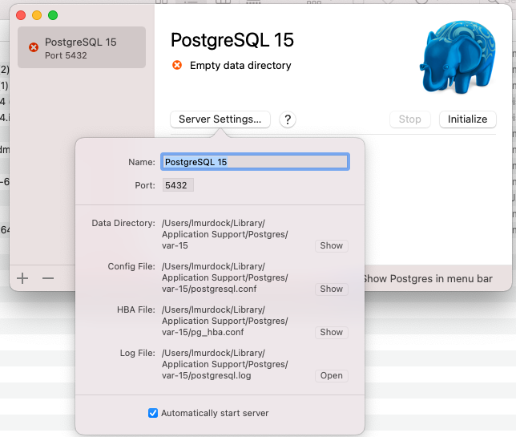

# Ruby Thursday

Going through the first tuturial

## Ruby Thurday 1 

https://www.youtube.com/watch?v=Bw9jfBUQTkc

### Install RVM

[Install RVM step by step](https://nrogap.medium.com/install-rvm-in-macos-step-by-step-d3b3c236953b)
    
        HilarysMacPro:rails lmurdock$ brew update
        HilarysMacPro:rails lmurdock$ brew install gnupg
        HilarysMacPro:rails lmurdock$ gpg --keyserver hkp://pool.sks-keyservers.net --recv-keys 409B6B1796C275462A1703113804BB82D39DC0E3 7D2BAF1CF37B13E2069D6956105BD0E739499BDB
        gpg: directory '/Users/lmurdock/.gnupg' created
        gpg: keybox '/Users/lmurdock/.gnupg/pubring.kbx' created
        gpg: keyserver receive failed: Server indicated a failure
        HilarysMacPro:rails lmurdock$ gpg --recv-keys 409B6B1796C275462A1703113804BB82D39DC0E3 7D2BAF1CF37B13E2069D6956105BD0E739499BDB
        gpg: key 105BD0E739499BDB: 1 duplicate signature removed
        gpg: /Users/lmurdock/.gnupg/trustdb.gpg: trustdb created
        gpg: key 105BD0E739499BDB: public key "Piotr Kuczynski <piotr.kuczynski@gmail.com>" imported
        gpg: key 3804BB82D39DC0E3: public key "Michal Papis (RVM signing) <mpapis@gmail.com>" imported
        gpg: Total number processed: 2
        gpg:               imported: 2
        HilarysMacPro:rails lmurdock$ \curl -sSL https://get.rvm.io | bash
        Downloading https://github.com/rvm/rvm/archive/master.tar.gz
        Installing RVM to /Users/lmurdock/.rvm/
            Adding rvm PATH line to /Users/lmurdock/.profile /Users/lmurdock/.mkshrc /Users/lmurdock/.bashrc /Users/lmurdock/.zshrc.
            Adding rvm loading line to /Users/lmurdock/.profile /Users/lmurdock/.bash_profile /Users/lmurdock/.zlogin.
        Installation of RVM in /Users/lmurdock/.rvm/ is almost complete:

        To start using RVM you need to run `source /Users/lmurdock/.rvm/scripts/rvm`
        in all your open shell windows, in rare cases you need to reopen all shell windows.

        Thanks for installing RVM 🙏
        Please consider donating to our open collective to help us maintain RVM.

        👉  Donate: https://opencollective.com/rvm/donate

        HilarysMacPro:rails lmurdock$ rvm list
        -bash: rvm: command not found

either open a new shell or do this

        HilarysMacPro:rails lmurdock$ source /Users/lmurdock/.rvm/scripts/rvm
        HilarysMacPro:rails lmurdock$ rvm list

        # No rvm rubies installed yet. Try 'rvm help install'.
        
        HilarysMacPro:rails lmurdock$ 

### Install RUBY

* Ruby Version in Mastodon - https://github.com/mastodon/mastodon/blob/main/.ruby-version

        ruby -v
        rvm list known

        HilarysMacPro:rails lmurdock$ rvm install ruby 3.0
        Searching for binary rubies, this might take some time.
        No binary rubies available for: osx/11.6/x86_64/ruby-3.0.5.
        Continuing with compilation. Please read 'rvm help mount' to get more information on binary rubies.
        Checking requirements for osx.
        Installing requirements for osx.
        Updating system..........
        Installing required packages: autoconf, automake, coreutils, libyaml, zlib........
        Certificates bundle '/usr/local/etc/openssl@1.1/cert.pem' is already up to date.
        Requirements installation successful.
        Installing Ruby from source to: /Users/lmurdock/.rvm/rubies/ruby-3.0.5, this may take a while depending on your cpu(s)...
        ruby-3.0.5 - #downloading ruby-3.0.5, this may take a while depending on your connection...
          % Total    % Received % Xferd  Average Speed   Time    Time     Time  Current
                                         Dload  Upload   Total   Spent    Left  Speed
        100 20.3M  100 20.3M    0     0  58.5M      0 --:--:-- --:--:-- --:--:-- 58.4M
        ruby-3.0.5 - #extracting ruby-3.0.5 to /Users/lmurdock/.rvm/src/ruby-3.0.5.....
        ruby-3.0.5 - #autogen.sh.
        ruby-3.0.5 - #configuring................................................................
        ruby-3.0.5 - #post-configuration.
        ruby-3.0.5 - #compiling......................................................................
        ruby-3.0.5 - #installing...............
        ruby-3.0.5 - #making binaries executable...
        Installed rubygems 3.2.33 is newer than 3.0.9 provided with installed ruby, skipping installation, use --force to force installation.
        ruby-3.0.5 - #gemset created /Users/lmurdock/.rvm/gems/ruby-3.0.5@global
        ruby-3.0.5 - #importing gemset /Users/lmurdock/.rvm/gemsets/global.gems.........................................-
        ruby-3.0.5 - #generating global wrappers........
        ruby-3.0.5 - #gemset created /Users/lmurdock/.rvm/gems/ruby-3.0.5
        ruby-3.0.5 - #importing gemsetfile /Users/lmurdock/.rvm/gemsets/default.gems evaluated to empty gem list
        ruby-3.0.5 - #generating default wrappers........
        ruby-3.0.5 - #adjusting #shebangs for (gem irb erb ri rdoc testrb rake).
        Install of ruby-3.0.5 - #complete 
        Ruby was built without documentation, to build it run: rvm docs generate-ri
        HilarysMacPro:rails lmurdock$  

### Install Rails

        
        HilarysMacPro:rails lmurdock$ ruby -v
        ruby 3.0.5p211 (2022-11-24 revision ba5cf0f7c5) [x86_64-darwin20]
        HilarysMacPro:rails lmurdock$ ls -la
        total 0
        drwxr-xr-x  2 lmurdock  staff   64 Dec 27 01:28 .
        drwxr-xr-x  4 lmurdock  staff  128 Dec 27 01:28 ..
        HilarysMacPro:rails lmurdock$ gem install rails
        Fetching thor-1.2.1.gem
        Fetching method_source-1.0.0.gem
        Fetching i18n-1.12.0.gem
        Fetching zeitwerk-2.6.6.gem
        Fetching concurrent-ruby-1.1.10.gem
        Fetching tzinfo-2.0.5.gem
        Fetching activesupport-7.0.4.gem
        Fetching nokogiri-1.13.10-x86_64-darwin.gem
        Fetching crass-1.0.6.gem
        Fetching loofah-2.19.1.gem
        Fetching rails-html-sanitizer-1.4.4.gem
        Fetching rails-dom-testing-2.0.3.gem
        Fetching rack-2.2.5.gem
        Fetching rack-test-2.0.2.gem
        Fetching erubi-1.12.0.gem
        Fetching builder-3.2.4.gem
        Fetching actionview-7.0.4.gem
        Fetching actionpack-7.0.4.gem
        Fetching railties-7.0.4.gem
        Fetching mini_mime-1.1.2.gem
        Fetching marcel-1.0.2.gem
        Fetching activemodel-7.0.4.gem
        Fetching activerecord-7.0.4.gem
        Fetching globalid-1.0.0.gem
        Fetching activejob-7.0.4.gem
        Fetching activestorage-7.0.4.gem
        Fetching actiontext-7.0.4.gem
        Fetching mail-2.8.0.gem
        Fetching actionmailer-7.0.4.gem
        Fetching actionmailbox-7.0.4.gem
        Fetching websocket-extensions-0.1.5.gem
        Fetching rails-7.0.4.gem
        Fetching websocket-driver-0.7.5.gem
        Fetching nio4r-2.5.8.gem
        Fetching actioncable-7.0.4.gem

And then it installed those gems. 

        HilarysMacPro:rails lmurdock$ rails -v
        Rails 7.0.4

## Ruby Thurday 2  

https://www.youtube.com/watch?v=0n7qK75Acl8    

### Create New Site

So for this repo we are using rails-sites  as our starting point and the whole set of sites is in the repo.  

If something needs to be independent, then we can break that out, but this tutorial is part of this activity-pub repo

     cd ~/src/activity-pub/rails-sites

    rails new ruby_thursday -T

Minus T is to make no tests since we will be using RSpec, which Mastodon uses too. 

I captured the out put of createing ruby_thursday and it is [ruby_thursday.out](../../rails-sites/ruby_thursday.out) 

    cd ruby_thursday
    rm -rf .git

I leave  `.gitignore` and `.gitattributes` on the idea that they modify git in the directory in ways that matter to 
ruby on rails.  

## Ruby Thurday 3 

[Get Launching #3: Setting up Postgres and Rspec on Rails](https://www.youtube.com/watch?v=yOdLXYJHhV8&t=24s)

### Install Postgresql

ended up just installing postgres app from here. https://postgresapp.com/downloads.html  Quick up and down, now fuss 
no muss, good for these tutorials.  But not much of a Postgres experience. 

To run the CLI tools using this.. Add this path to your .bashrc

    export PATH="$PATH:/Applications/Postgres.app/Contents/Versions/latest/bin"

then of course its `psql` command.

### Configure Rails

#### GemFile

Gemfile has the code bundles you will use and the versions.  

One thing we change is `sqllite` to `pg`. Where `pg` is postgres. 

You can see versions of gems at https://rubygems.org

from this:

    group :development, :test do
      # See https://guides.rubyonrails.org/debugging_rails_applications.html#debugging-with-the-debug-gem
      gem "debug", platforms: %i[ mri mingw x64_mingw ]
    end

to this:

    group :development, :test do
      gem 'better_errors'
      gem 'capybara-webkit'
      gem 'factory_girl_rails'
      gem 'ffaker'
      gem 'database_cleaner'
      gem 'letter_opener'
      gem 'rspec-rails'
      gem 'pry'
      gem 'pry-nav'
      gem 'pry-rails'
      gem 'simple_bdd'
      gem 'shoulda-matchers'
      gem 'spring'
      # See https://guides.rubyonrails.org/debugging_rails_applications.html#debugging-with-the-debug-gem
      gem "debug", platforms: %i[ mri mingw x64_mingw ]
    end

#### Bundle

    bundle
